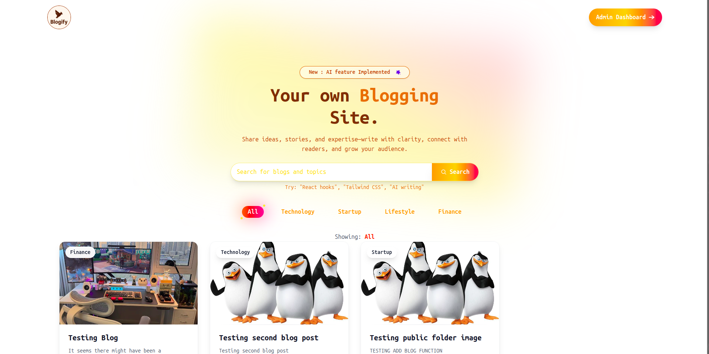
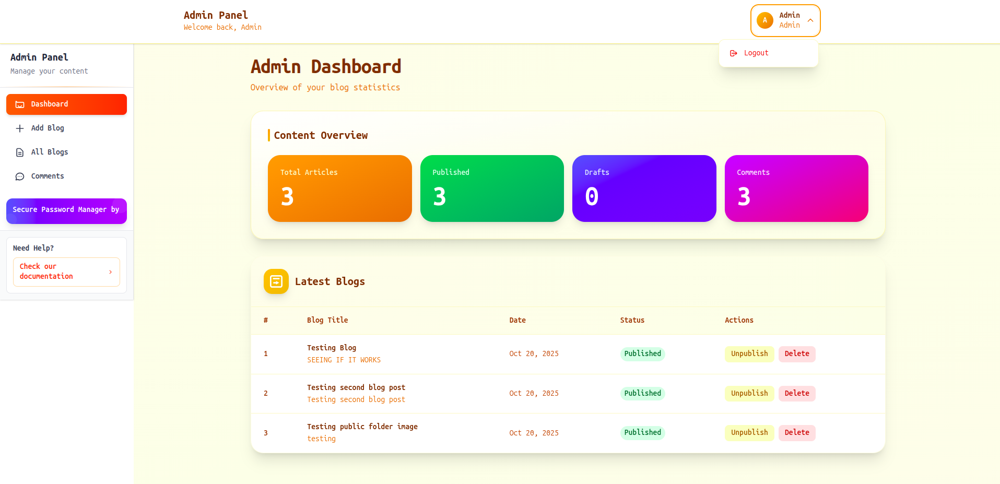

# 📝 Blogging Site - Modern Full Stack Blog Platform

[](https://vercel.com)
[](https://vercel.com)
[](https://reactjs.org/)
[](https://nodejs.org/)
[](https://mongodb.com/)

A modern, feature-rich blogging platform built with React, Node.js, and MongoDB. Features a beautiful frontend with admin dashboard, user authentication, rich text editor, AI content generation, and much more.

## Project Structure

```
Blogging-Site/
├── backend/
│   ├── src/
│   │   ├── config/          # Database and API configurations
│   │   ├── controllers/     # Route controllers
│   │   ├── middleware/      # Authentication & file upload
│   │   ├── models/          # MongoDB models
│   │   ├── routes/          # API routes
│   │   └── utils/           # Utility functions
│   ├── public/              # Static files
│   └── package.json
├── client/
│   ├── src/
│   │   ├── components/      # Reusable components
│   │   ├── pages/           # Page components
│   │   ├── context/         # React context
│   │   ├── assets/          # Static assets
│   │   └── utils/           # Utility functions
│   ├── images/              # Screenshots
│   └── package.json
└── README.md
```

## Screenshots

### Homepage

<<<<<<< HEAD

=======
<<<<<<< HEAD

=======

>>>>>>> 7fb6388 (Fixed the README. Completed the Site Documentation.)
>>>>>>> f6a47ae (Fixed the README. Completed the Site Documentation.)
_Modern and responsive homepage with featured blogs and newsletter subscription_

### Admin Dashboard

<<<<<<< HEAD

=======
<<<<<<< HEAD

=======

>>>>>>> 7fb6388 (Fixed the README. Completed the Site Documentation.)
>>>>>>> f6a47ae (Fixed the README. Completed the Site Documentation.)
_Comprehensive admin dashboard with blog management, analytics, and user controls_

## 📦 Installation

### Prerequisites

- Node.js (v18 or Higher)
- MongoDB (local or cloud instance)
- Cloudinary account (for image uploads)
- Google AI API key (for AI features)

### 1. Clone the Repository

```bash
git clone https://github.com/shivamkarn1/Blogging-Site.git
cd Blogging-Site
```

### 2. Backend Setup

```bash
cd backend
npm install
```

Create a `.env` file in the backend directory:

```env
PORT=8000
MONGODB_URI=your_mongodb_connection_string
JWT_SECRET=your_jwt_secret_key
CORS_ORIGIN=http://localhost:5173

# Cloudinary Configuration
CLOUDINARY_CLOUD_NAME=your_cloudinary_cloud_name
CLOUDINARY_API_KEY=your_cloudinary_api_key
CLOUDINARY_API_SECRET=your_cloudinary_api_secret

# Google AI Configuration
GEMINI_API_KEY=your_google_gemini_api_key

# Admin Credentials (Optional - for seeding)
ADMIN_EMAIL=admin@example.com
ADMIN_PASSWORD=your_admin_password
```

### 3. Frontend Setup

```bash
cd ../client
npm install
```

Create a `.env` file in the client directory:

```env
VITE_BACKEND_URL=http://localhost:8000
```

### 4. Start the Development Servers

#### Backend (Terminal 1):

```bash
cd backend
npm run dev
```

#### Frontend (Terminal 2):

```bash
cd client
npm run dev
```

The application will be available at:

- **Frontend**: `http://localhost:5173`
- **Backend**: `http://localhost:8000`

## Features

### Frontend Features

- **Modern UI/UX**: Clean, responsive design with Tailwind CSS
- **Blog Browsing**: Browse and search through blog posts
- **Blog Reading**: Rich text display with proper formatting
- **Newsletter Subscription**: Email subscription functionality
- **Responsive Design**: Works perfectly on desktop, tablet, and mobile
- **Fast Performance**: Built with Vite for optimal loading speeds

### Authentication & Security

- **JWT Authentication**: Secure token-based authentication
- **User Registration**: New user account creation
- **Admin Authentication**: Separate admin login system
- **Password Security**: Bcrypt encryption for passwords

### 👨‍💼 Admin Dashboard

- **Dashboard Analytics**: Blog statistics and overview
- **Blog Management**: Create, edit, delete, and publish blogs
- **Rich Text Editor**: Quill.js editor with formatting options
- **Media Upload**: Image upload with Cloudinary integration
- **Comment Management**: Monitor and moderate user comments
- **User Management**: View and manage user accounts
- **Draft System**: Save blogs as drafts before publishing

### AI Integration

- **AI Content Generation**: Google Gemini AI integration for content suggestions
- **Smart Descriptions**: AI-generated blog descriptions and metadata

### 🔒 SecureVault Integration

- **Password Manager**: Integrated SecureVault password manager
- **Secure Storage**: Safe password storage for admin users
- **Cross-platform Sync**: Sync passwords across devices
- **Auto-fill**: Automatic password filling capability

_SecureVault is a separate password manager application created by the same developer (Shivam Karn). It's seamlessly integrated into the admin panel to help administrators manage their passwords securely while working on the blog platform._

## 🛠️Tech Stack

### Frontend

- **Framework**: React 19.1.1
- **Build Tool**: Vite
- **Styling**: Tailwind CSS
- **Routing**: React Router DOM
- **HTTP Client**: Axios
- **Rich Text Editor**: Quill.js
- **Animations**: Framer Motion
- **Icons**: Lucide React
- **Notifications**: Sonner
- **Date Handling**: Moment.js
- **Markdown**: Marked

### Backend

- **Runtime**: Node.js
- **Framework**: Express.js
- **Database**: MongoDB with Mongoose
- **Authentication**: JWT (JSON Web Tokens)
- **Password Hashing**: Bcrypt
- **File Upload**: Multer
- **Cloud Storage**: Cloudinary
- **AI Integration**: Google Generative AI
- **CORS**: Cross-Origin Resource Sharing enabled

## 🚀 Deployment

### Frontend (Vercel)

1. Connect your GitHub repository to Vercel
2. Set the build command: `npm run build`
3. Set the output directory: `dist`
4. Add environment variables in Vercel dashboard

### Backend (Vercel)

1. Create `vercel.json` in the backend root (already included)
2. Deploy using Vercel CLI or GitHub integration
3. Add environment variables in Vercel dashboard

## API Documentation

### Authentication Endpoints

- `POST /api/v1/user/register` - User registration
- `POST /api/v1/user/login` - User login
- `POST /api/v1/admin/login` - Admin login

### Blog Endpoints

- `GET /api/v1/blog/` - Get all published blogs
- `GET /api/v1/blog/:id` - Get single blog
- `POST /api/v1/blog/` - Create blog (Admin only)
- `PUT /api/v1/blog/:id` - Update blog (Admin only)
- `DELETE /api/v1/blog/:id` - Delete blog (Admin only)

### Admin Endpoints

- `GET /api/v1/admin/dashboard` - Dashboard statistics
- `GET /api/v1/admin/blogs` - Get all blogs (including drafts)
- `GET /api/v1/admin/comments` - Get all comments
- `POST /api/v1/admin/upload` - Upload media files

## 👨‍💻 Admin Panel Features

### Dashboard

- **Analytics Overview**: Total blogs, comments, and user statistics
- **Recent Activities**: Latest blog posts and user interactions
- **Quick Actions**: Fast access to common administrative tasks

### Blog Management

- **Create & Edit**: Rich text editor with formatting options
- **Media Library**: Upload and manage images with Cloudinary
- **Categories**: Organize blogs by categories
- **Publishing**: Draft and publish system
- **SEO**: Meta descriptions and tags

### User & Comment Management

- **User Overview**: View registered users and their activities
- **Comment Moderation**: Approve, delete, or manage comments
- **Engagement Analytics**: Track user engagement metrics

## 🔐 About SecureVault

SecureVault is an integrated password manager created by Shivam Karn, the same developer behind this blogging platform. It's designed specifically for developers and content creators who need secure password management while working on their projects.

### SecureVault Features:

- 🔒 **End-to-End Encryption**: Your passwords are encrypted before leaving your device
- **Cross-Platform Sync**: Access your passwords on any device
- **Auto-Fill**: Automatically fill passwords in forms
- **Modern UI**: Clean, intuitive interface
- **Secure Storage**: Military-grade encryption for password storage

**Access SecureVault**: The password manager appears as integrated ads and popups within the admin panel, making it convenient for administrators to manage their credentials while working on the blog.

## 🤝 Contributing

1. Fork the project
2. Create your feature branch (`git checkout -b feature/AmazingFeature`)
3. Commit your changes (`git commit -m 'Add some AmazingFeature'`)
4. Push to the branch (`git push origin feature/AmazingFeature`)
5. Open a Pull Request

## 👤 Author

**Shivam Karn**

- GitHub: [@shivamkarn1](https://github.com/shivamkarn1)
- Portfolio: [Your Portfolio URL]

---

**⚡ Built with ❤️ by Shivam Karn**
